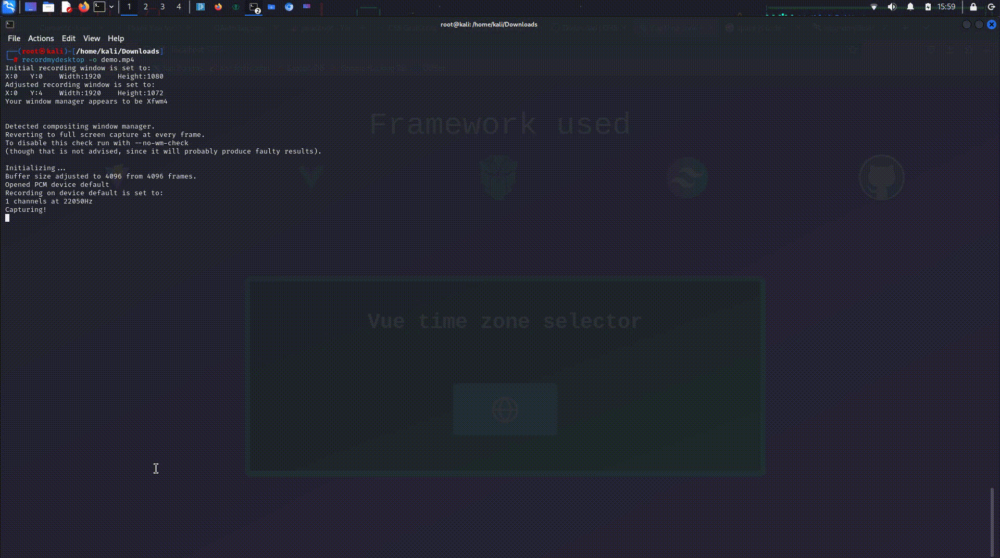

# Vue time zone picker ( Stage au Crealp 2024 )

# Demo

# Contexte :

Dans le cas d un stage au [Crealp](https://www.crealp.ch) pendant 3 jours ; on m a proposé de poursuivre le projet de UserQuentyn ( https://github.com/User12778309/vue_time_zone_picker )

## Prérequis

Cloner le projet : https://github.com/User12778309/vue_time_zone_picker

> git clone https://github.com/User12778309/vue_time_zone_picker

# Description

j ai dû intégrer le projet de UserQuentyn dans une popup primevue ( Popover )

Ceci est un POC ( Proof Of Concept )

# Framework utilisés

- [Vue JS](https://www.vuejs.org) : FrameWork JS
- [Primevue](https://primevue.org/) : Librarie de composant Vue JS
- [Tailwind](https://tailwindcss.com/) : Framework CSS
- [Vite](https://vite.dev/) : Outil de compilation pour les projets JS

# Journal de bord

## Jour 1 :

- Decouverte des logiciels Crealp ( Guardaval )
- Decouverte du projet
- Decouverte du projet de base ( vue , primevue , tailwind , vite )
- Brainstorming ( Collaboration au sujet du projet )
- Dévloppement

## Jour 2 :

- Rencontre des collaborateurs du Crealp
- Installation de GitKraken ( Alternative Github Desktop pour linux )
- Dégustation de Cookies ( on a bien mangé )
- Decouverte des canvas 

## Jour 3 :

- Mises en place des canvas
- Création du easter egg
- Aide de mon maître de stage
- Ecriture de README.md ( ce fichier )

# Problèmes rencontrés

- Linux ( Debian ( Kali linux ) ) et git :
Git CLI ne marché pas sur Linux , donc on a opté pour GitKraken

- Problémes de canvas : Complication au niveaux de l opacitée des images 

- Problémes de partabilité JS : mon maître de stage êtant sur Mac OS et moi sur linux ( Debian ( kali linux ) ) , nous avons eu des problème de classe dû à l opacité des canvas 

# Amelioration

- Décoration du texte info popover
- Evenement de la selection

# Après le stage

- Continué les framework cités
- Faire les amélioration